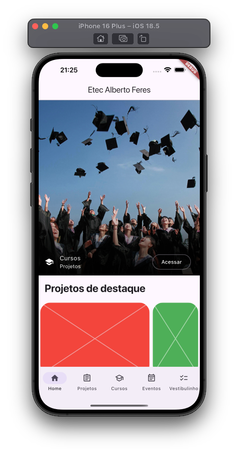
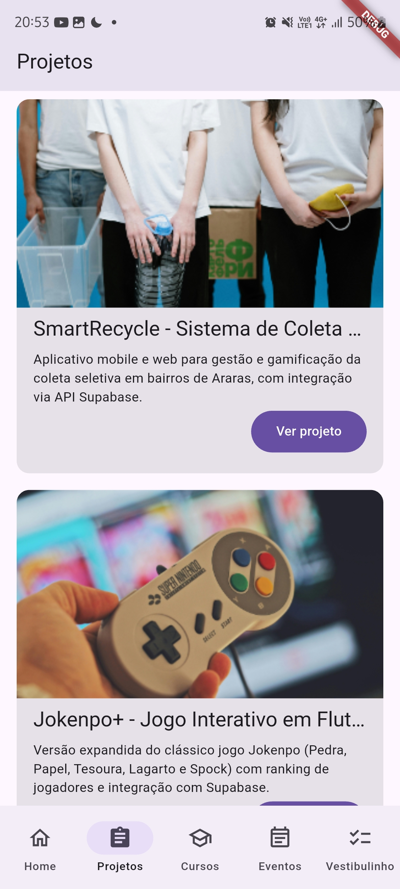

# TCShelf

Neste projeto iremos criar um aplicativo que irá mostrar os TCCs de vocês como uma biblioteca digital, além de divulgar cursos oferecidos na Etec Prefeito Alberto Feres.

## Dependências

Neste projeto iremos utilizar as seguintes dependências:

- Supabase - Banco de dados
- Riverpod - Gerenciamento de estado
- Riverpod_annotation - Anotações para Riverpod
- Riverpod_generator - Geração de código para Riverpod
- Freezed - Geração de código para classes imutáveis
- Freezed_annotation - Anotações para Freezed
- Build_runner - Geração de código
- DotEnv - Variáveis de ambiente

### Instalando dependências

Na raiz do projeto execute o seguintes comandos:

```bash
flutter pub add flutter_dotenv flutter_riverpod freezed_annotation go_router json_annotation riverpod_annotation supabase_flutter

flutter pub add --dev build_runner freezed json_serializable riverpod_generator
```

## Criando a classe App

1. Crie o arquivo src/app.dart;
2. Copie o código abaixo para o arquivo src/app.dart;

```dart
import 'package:flutter/material.dart';
import 'package:flutter_riverpod/flutter_riverpod.dart';
import 'package:tcc_flutter_app/src/core/providers/app_providers.dart';

class App extends ConsumerWidget {
  const App({super.key});

  @override
  Widget build(BuildContext context, WidgetRef ref) {
    return MaterialApp.router (
      routerConfig: null,
    );
  }
}
```

## Ajustar o main.dart

1. Abra o arquivo main.dart;
2. Copie o código abaixo para o arquivo main.dart;

```dart
import 'package:flutter/material.dart';
import 'package:tcc_flutter_app/src/app.dart';

void main() {
  runApp(const App());
}
```

## Configurando o Supabase

1. No arquivo main.dart, ajuste o código para inicializar o Supabase;

```dart
import 'package:flutter/material.dart';
import 'package:tcc_flutter_app/src/app.dart';
import 'package:supabase_flutter/supabase_flutter.dart';

void main() async {
  WidgetsFlutterBinding.ensureInitialized();
  await dotenv.load(fileName: '.env'); 
  await Supabase.initialize(
    url: dotenv.env['SUPABASE_URL']!, 
    anonKey: dotenv.env['SUPABASE_ANON_KEY']!,
  );
  runApp(ProviderScope(child: const App()));
}
```

## Configurando o dotenv

O dotenv é um package que permite que você crie variáveis de ambiente para sua aplicação, protegendo-as no código-fonte.

1. Crie o arquivo .env na raiz do projeto;
2. Copie o código abaixo para o arquivo .env;

```dart
SUPABASE_URL=sua_url_supabase
SUPABASE_ANON_KEY=sua_chave_anonima_supabase
```

> Lembre-se de substituir os valores de SUPABASE_URL e SUPABASE_ANON_KEY pelo valores do seu projeto no Supabase. Já fizemos estas configurações em sala de aula, utilize sua credenciais do Supabase.

> Lembre-se de adicionar o arquivo .env na pasta .gitignore, para que ele não seja enviado para o repositório remoto.


## Utilizando o MVVM como estrutura de arquitetura

Nós iremos utilizar o MVVM como estrutura de arquitetura para o nosso aplicativo. O MVVM é um padrão de arquitetura que permite que você separe a lógica de negócios da interface do usuário.

Os providers irão gerenciar o estado da aplicação, ou seja, irão controlar os dados que serão exibidos na interface do usuário.

Iremos utilizar vários providers me nosso aplicativo, eles serão a base para a criação de um estado global da aplicação, assim como o pattern MVVM.

### Criando nossos primeiros providers

1. Crie o arquivo src/core/providers/app_providers.dart;
2. Copie o código abaixo para o arquivo src/core/providers/app_providers.dart;

```dart
import 'package:flutter_riverpod/flutter_riverpod.dart';
import 'package:supabase_flutter/supabase_flutter.dart';

final darkModeProvider = StateProvider<bool>((ref) => false);
final supabaseProvider = Provider<SupabaseClient>((ref) => Supabase.instance.client);
```

> O `Provider` é um provider que permite que você compartilhe o estado de uma variável globalmente na aplicação, o `StateProvider` além de compartilhar o estado de uma variável globalmente na aplicação, ele permite que você altere o estado de uma variável globalmente na aplicação.

Iremos reutilizar o `SupabaseClient` em todos os providers que precisarem de acesso ao banco de dados.

### Criando o Model

1. Crie o arquivo src/features/cursos/model/curso_model.dart;
2. Copie o código abaixo para o arquivo src/features/cursos/model/curso_model.dart;

```dart
import 'package:freezed_annotation/freezed_annotation.dart';

part 'curso_model.g.dart';
part 'curso_model.freezed.dart';

@freezed
class CursoModel with _$CursoModel {
  const factory CursoModel({
    required String id,
    required String nome,
    required String descricao,
    required String professor,
    required String imagem,
  }) = _CursoModel;

  factory CursoModel.fromJson(Map<String, dynamic> json) =>
      _$CursoModelFromJson(json);
}
```

> Execute o comando abaixo para gerar o código do model:

```bash
flutter pub run build_runner build -d
```

### Criando o Repository de Cursos

Iremo utulizar o pattern `Repository` para criar um repositório de cursos.

1. Crie o arquivo src/features/cursos/model/repository/curso_repository.dart;
2. Copie o código abaixo para o arquivo src/features/cursos/model/repository/curso_repository.dart;

```dart
import 'package:tcc_flutter_app/src/features/cursos/model/curso_model.dart';

abstract class CursoRepository {
  Future<List<CursoModel>> getCursos();
}
```

### Criando o RepositoryImpl

1. Crie o arquivo src/features/cursos/model/repository/curso_repository_impl.dart;
2. Copie o código abaixo para o arquivo src/features/cursos/model/repository/curso_repository_impl.dart;

```dart
import 'package:riverpod_annotation/riverpod_annotation.dart';
import 'package:tcc_flutter_app/src/core/providers/app_providers.dart';
import 'package:tcc_flutter_app/src/features/cursos/model/curso_model.dart';
import 'package:tcc_flutter_app/src/features/cursos/model/repository/curso_repository.dart';

part 'curso_repository_impl.g.dart';

@riverpod
class CursoRepositoryImpl extends _$CursoRepositoryImpl implements CursoRepository {
  @override
  Future<List<CursoModel>> getCursos() async {
    final cursos = await ref.watch(supabaseProvider).from('cursos').select();
    return [for(final curso in cursos) CursoModel.fromJson(curso)];
  }
}
```

### Criando o provider para o repositorio de cursos

1. Altere o arquivo curso_repository_impl.dart para:

```dart
import 'package:flutter_riverpod/flutter_riverpod.dart';
import 'package:riverpod_annotation/riverpod_annotation.dart';
import 'package:supabase_flutter/supabase_flutter.dart';
import 'package:tcc_flutter_app/src/core/providers/app_providers.dart';
import 'package:tcc_flutter_app/src/features/cursos/model/curso_model.dart';
import 'package:tcc_flutter_app/src/features/cursos/model/repository/curso_repository.dart';

part 'curso_repository_impl.g.dart';

@riverpod
class CursoRepositoryImpl extends _$CursoRepositoryImpl implements CursoRepository {
  @override
  Future<List<CursoModel>> getCursos() async {
    final cursos = await ref.watch(supabaseProvider).from('cursos').select();
    return [for(final curso in cursos) CursoModel.fromJson(curso)];
  }
}

// Provider para o repositorio de cursos
@riverpod
cursoRepositoryImpl (Ref ref) {
  return CursoRepositoryImpl(supabase: ref.watch(supabaseProvider));
}
```

> Acima criamos o provider para o repositorio de cursos, ele será reutilizado como injecao de dependencia no projeto.

### Criando o View Model

1. Crie o arquivo src/features/cursos/viewmodel/cursos_viewmodel.dart;
2. Copie o código abaixo para o arquivo src/features/cursos/viewmodel/cursos_viewmodel.dart;

```dart
import 'package:riverpod_annotation/riverpod_annotation.dart';
import 'package:tcc_flutter_app/src/features/cursos/model/curso_model.dart';
import 'package:tcc_flutter_app/src/features/cursos/model/repository/curso_repository_impl.dart';

part 'cursos_viewmodel.g.dart';

@Riverpod(keepAlive: true)
class CursosViewModel extends _$CursosViewModel {
  @override
  FutureOr<List<CursoModel>> build() async {
    return ref.watch(cursoRepositoryImplProvider).getCursos();
  }
}
```

3. Execute o comando abaixo para gerar o código do view model:

```bash
flutter pub run build_runner build -d
```

> Agora o view model foi gerado e ele irá utilizar o repositorio de cursos para buscar os cursos para gerar o estado ao qual nossas Views irão se inscrever para receber os cursos.

### Criando a View CursosView

1. Crie o arquivo src/features/cursos/view/cursos_view.dart;
2. Copie o código abaixo para o arquivo src/features/cursos/view/cursos_view.dart;

```dart
import 'package:flutter/material.dart';
import 'package:flutter_riverpod/flutter_riverpod.dart';
import 'package:tcc_flutter_app/src/features/cursos/view/widgets/lista_cursos_widget.dart';
import 'package:tcc_flutter_app/src/features/cursos/viewmodel/cursos_viewmodel.dart';

class CursosView extends ConsumerWidget {
  const CursosView({super.key});

  @override
  Widget build(BuildContext context, WidgetRef ref) {
    final cursos = ref.watch(cursosViewModelProvider);
    return Scaffold(
      appBar: AppBar(title: const Text('Cursos')),
      body: cursos.when(
        data: (cursos) {
          return ListaCursosWidget(cursos: cursos);
        },
        error: (error, stackTrace) =>
            const Center(child: Text('Erro ao carregar cursos')),
        loading: () => const Center(child: CircularProgressIndicator()),
      ),
    );
  }
}
```
> Utilizamos o `ConsumerWidget` para que possamos utilizar o `WidgetRef` para acessar o `Provider` que irá nos fornecer os cursos. Também utilizamos o when para que possamos mostrar uma mensagem de loading, error ou data, este é um recurso do `riverpod` que nos ajuda a gerenciar o estado de forma mais simples.


3. Crie o arquivo src/features/cursos/view/widgets/lista_cursos_widget.dart;
4. Copie o código abaixo para o arquivo src/features/cursos/view/widgets/lista_cursos_widget.dart;

```dart
import 'package:flutter/material.dart';
import 'package:tcc_flutter_app/src/features/cursos/model/curso_model.dart';

class ListaCursosWidget extends StatelessWidget {
  const ListaCursosWidget({super.key, required this.cursos});

  final List<CursoModel> cursos;

  @override
  Widget build(BuildContext context) {
    return ListView.separated(
      itemCount: cursos.length,
      itemBuilder: (context, index) {
        final curso = cursos[index];
        return ListTile(
          leading: CircleAvatar(child: Text(curso.nome!.substring(0, 1))),
          title: Text(curso.nome!),
          subtitle: Text(curso.descricao!),
        );
      },
      separatorBuilder: (BuildContext context, int index) => const Divider(),
    );
  }
}

```
5. Crie o arquivo src/features/cursos/view/detalhe_curso_view.dart;
6. Copie o código abaixo para o arquivo src/features/cursos/view/detalhe_curso_view.dart;

```dart
import 'package:flutter/material.dart';
import 'package:tcc_flutter_app/src/features/cursos/model/curso_model.dart';

class DetalheCursoView extends StatelessWidget {
  const DetalheCursoView({super.key, required this.curso});

  final CursoModel curso;

  @override
  Widget build(BuildContext context) {
    return CustomScrollView(
      slivers: [
        SliverAppBar(
          expandedHeight: 250,
          pinned: true,
          flexibleSpace: FlexibleSpaceBar(
            centerTitle: true,
            background: Image.network(
              curso.urlImagem!,
              fit: BoxFit.cover,
              cacheHeight: 250,
              loadingBuilder: (context, child, loadingProgress) {
                if (loadingProgress == null) return child;
                final total = loadingProgress.expectedTotalBytes;
                final loaded = loadingProgress.cumulativeBytesLoaded;
                return Align(
                  alignment: Alignment.bottomCenter,
                  child: LinearProgressIndicator(
                    value: total != null ? loaded / total : null,
                  ),
                );
              },
            ),
          ),
        ),
        SliverList(
          delegate: SliverChildListDelegate([
            Padding(
              padding: const EdgeInsets.symmetric(vertical: 8.0, horizontal: 16.0),
              child: Text(curso.nome!, style: Theme.of(context).textTheme.titleLarge),
            ),
            Padding(
              padding: const EdgeInsets.symmetric(vertical: 8.0, horizontal: 16.0),
              child: Text(curso.descricao!, style: Theme.of(context).textTheme.bodyLarge),
            ),
            Padding(
              padding: const EdgeInsets.symmetric(vertical: 8.0, horizontal: 16.0),
              child: Text(curso.ementaResumida!, style: Theme.of(context).textTheme.bodyLarge),
            ),
          ]),
        ),
        SliverFillRemaining(),
      ],
    );
  }
}
```
## Utilizando o GoRouter para a navegação no aplicativo

Nós iremos utilizar o package `go_router` para a navegação no aplicativo. O GoRouter é um package que permite que você crie rotas para sua aplicação de forma simples e eficiente. 

> Agora que as views foram criadas, vamos criar as rotas para elas.


### Criando as rotas

1. Crie o arquivo src/core/routes/router.dart;
2. Copie o código abaixo para o arquivo src/core/routes/router.dart;

> Este código irá definir as rotas do aplicativo, no momento apenas as rotas de cursos e detalhes de cursos.

```dart
import 'package:go_router/go_router.dart';
import 'package:tcc_flutter_app/src/features/cursos/model/curso_model.dart';
import 'package:tcc_flutter_app/src/features/cursos/view/cursos_view.dart';
final router = GoRouter(
  initialLocation: '/cursos',
  routes: [
  GoRoute(
    path: '/cursos',
    builder: (context, state) => const CursosView(),
    routes: [
      GoRoute(
        path: '/curso',
        builder: (context, state) {
          final curso = state.extra as CursoModel;
          return DetalheCursoView(curso: curso);
        },
      )
    ]
  ),
]);
```

### Inicializando o GoRouter

1. Ajuste o arquivo app.dart para inicializar o GoRouter;
2. Inclua o objeto router no MaterialApp.router, no arquivo src/app.dart;

```dart
import 'package:flutter/material.dart';
import 'package:flutter_riverpod/flutter_riverpod.dart';
import 'package:tcc_flutter_app/src/core/providers/app_providers.dart';
import 'package:tcc_flutter_app/src/core/routes/router.dart';

class App extends ConsumerWidget {
  const App({super.key});

  @override
  Widget build(BuildContext context, WidgetRef ref) {
    return MaterialApp.router (
      routerConfig: router,
    );
  }
}
```

## Navegando com GoRouter

Precisamos ajustar o arquivo cursos_view.dart para que possamos navegar para a tela de detalhes do curso.

1. Ajuste o arquivo cursos_view.dart para que possamos navegar para a tela de detalhes do curso;
2. No arquivo ListaCursosWidget, ajuste o onTap para que possamos navegar para a tela de detalhes do curso;


```dart
import 'package:go_router/go_router.dart';
import 'package:tcc_flutter_app/src/features/cursos/model/curso_model.dart';
import 'package:tcc_flutter_app/src/features/cursos/view/cursos_view.dart';
import 'package:tcc_flutter_app/src/features/cursos/view/detalhe_curso_view.dart';

final router = GoRouter(
  initialLocation: '/cursos',
  routes: [
    GoRoute(
      path: '/cursos',
      builder: (context, state) => const CursosView(),
      routes: [
        GoRoute(
          path: '/curso',
          builder: (context, state) {
            final curso = state.extra as CursoModel;
            return DetalheCursoView(curso: curso);
          },
        ),
      ],
    ),
  ],
);

```
> Como temos apenas uma página no momento, esta será a rota inicial do aplicativo.


## Navegando com NavigationShell

Iremos utilizar a BottomNavigationBar para navegar entre as telas do aplicativo.

1. Crie o arquivo src/core/ui/widgets/navigation_shell_route.dart;
2. Copie o código abaixo para o arquivo src/core/ui/widgets/navigation_shell_route.dart;

```dart
import 'package:flutter/material.dart';
import 'package:go_router/go_router.dart';

class ScaffoldWithNavigationShell extends StatelessWidget {
  const ScaffoldWithNavigationShell({super.key, required this.shell});

  // Iremos para previnir issues de navegaçao e podermos criar sub-rotas nas configurações do GoRouter
  final StatefulNavigationShell shell;

  @override
  Widget build(BuildContext context) {
    return Scaffold(
      body: shell,
      bottomNavigationBar: NavigationBar(
        selectedIndex: shell.currentIndex,
        onDestinationSelected: (index) =>
            shell.goBranch(index, initialLocation: index == shell.currentIndex),
        destinations: [
          NavigationDestination(
            icon: Icon(Icons.home_outlined),
            selectedIcon: Icon(Icons.home),
            label: 'Home',
          ),
          NavigationDestination(
            icon: Icon(Icons.assignment_outlined),
            selectedIcon: Icon(Icons.assignment),
            label: 'Business',
          ),
          NavigationDestination(
            icon: Icon(Icons.school_outlined),
            selectedIcon: Icon(Icons.school),
            label: 'School',
          ),
          NavigationDestination(
            icon: Icon(Icons.event_note_outlined),
            selectedIcon: Icon(Icons.event_note),
            label: 'Event',
          ),
          NavigationDestination(
            icon: Icon(Icons.checklist_outlined),
            selectedIcon: Icon(Icons.checklist),
            label: 'Vestibulinho',
          ),
        ],
      ),
    );
  }
}

```

> Agora iremos ajustar a navegação inicial, incluir a página de cursos e realizar os testes iniciais de navegação.

3. Ajuste o arquivo router.dart para que possamos configurar as rotas inicias, assim como suas sub-rotas;
4. Inclua o código abaixo no arquivo router.dart;

```dart
import 'package:flutter/material.dart';
import 'package:go_router/go_router.dart';
import 'package:tcc_flutter_app/src/core/ui/widgets/navigation_shell_route.dart';
import 'package:tcc_flutter_app/src/features/cursos/model/curso_model.dart';
import 'package:tcc_flutter_app/src/features/cursos/view/cursos_view.dart';
import 'package:tcc_flutter_app/src/features/cursos/view/detalhe_curso_view.dart';

final router = GoRouter(
  initialLocation: '/cursos',
  routes: [
    StatefulShellRoute.indexedStack(
      builder: (context, state, navigationShell) =>
          ScaffoldWithNavigationShell(shell: navigationShell),
      branches: [
        StatefulShellBranch(
          routes: [
            GoRoute(
              path: '/home',
              builder: (context, state) =>
                  Container(color: Colors.red.shade100),
            ),
          ],
        ),
        StatefulShellBranch(
          routes: [
            GoRoute(
              path: '/projetos',
              builder: (context, state) =>
                  Container(color: Colors.green.shade100),
            ),
          ],
        ),
        StatefulShellBranch(
          routes: [
            GoRoute(
              path: '/cursos',
              builder: (context, state) => const CursosView(),
              routes: [
                GoRoute(
                  path: '/curso',
                  builder: (context, state) {
                    final curso = state.extra as CursoModel;
                    return DetalheCursoView(curso: curso);
                  },
                ),
              ],
            ),
          ],
        ),
        StatefulShellBranch(
          routes: [
            GoRoute(
              path: '/eventos',
              builder: (context, state) =>
                  Container(color: Colors.blue.shade100),
            ),
          ],
        ),
        StatefulShellBranch(
          routes: [
            GoRoute(
              path: '/vestibulinho',
              builder: (context, state) =>
                  Container(color: Colors.yellow.shade100),
            ),
          ],
        ),
      ],
    ),
  ],
);

```

> Configuramos a navegação inicial do aplicativo, adicionando as rotas principais e suas sub-rotas. A funcionalidade de cursos já esta criada, então a deixamos configurada como rota inicial, assim como a navegação para as demais telas está ajustada; conforme implementamos novas features elas serão ajustadas.


### Ajustando a navegaçao para a HomeView

1. Ajuste o arquivo router.dart para que possamos configurar a rota para a HomeView;
2. Inclua o código abaixo no arquivo router.dart, substituindo a ágina colorida por uma tela existente, a HomeView;
```dart
        StatefulShellBranch(
          routes: [
            GoRoute(
              path: '/home',
              builder: (context, state) =>
                  HomeView()
            ),
          ],
        ),
```

3. Ajuste o arquivo home_view.dart com o código abaixo.

```dart
import 'package:flutter/material.dart';
import 'package:flutter_riverpod/flutter_riverpod.dart';

class HomeView extends ConsumerWidget {
  const HomeView({super.key});

  @override
  Widget build(BuildContext context, WidgetRef ref) {
    return CustomScrollView(
      slivers: [
        SliverAppBar(title: const Text('Etec Alberto Feres')),
        SliverToBoxAdapter(
          child: Stack(
            children: [
              Image.network(
                'https://images.pexels.com/photos/267885/pexels-photo-267885.jpeg',
                fit: BoxFit.cover,
                height: MediaQuery.of(context).size.height * .5,
                width: MediaQuery.of(context).size.width,
              ),
              SizedBox(
                height: MediaQuery.of(context).size.height * .5,
                width: MediaQuery.of(context).size.width,
                child: Container(
                  decoration: const BoxDecoration(
                    gradient: LinearGradient(
                      begin: Alignment.center,
                      end: Alignment.bottomCenter,
                      colors: [
                        Colors.transparent,
                        Colors.black12,
                        Colors.black54,
                        Colors.black87,
                      ],
                    ),
                  ),
                  alignment: Alignment.bottomRight,
                  child: ListTile(
                    leading: Icon(Icons.school, color: Colors.white),
                    title: Text(
                      'Cursos',
                      style: TextStyle(color: Colors.white),
                    ),
                    subtitle: Text(
                      'Projetos',
                      style: TextStyle(color: Colors.white),
                    ),
                    trailing: OutlinedButton(
                      onPressed: () {},
                      child: Text(
                        'Acessar',
                        style: TextStyle(color: Colors.white),
                      ),
                    ),
                  ),
                ),
              ),
            ],
          ),
        ),
        SliverPadding(
          padding: const EdgeInsets.all(16),
          sliver: SliverToBoxAdapter(
            child: Text(
              'Projetos de destaque',
              style: Theme.of(
                context,
              ).textTheme.headlineMedium?.copyWith(fontWeight: FontWeight.bold),
            ),
          ),
        ),
        SliverToBoxAdapter(
          child: SizedBox(
            height: 200,
            child: CarouselView(
              itemSnapping: true,
              itemExtent: 300,
              children: [
                Container(
                  color: Colors.red.shade500,
                  child: Placeholder(color: Colors.red.shade200),
                ),
                Container(
                  color: Colors.green.shade500,
                  child: Placeholder(color: Colors.green.shade200),
                ),
                Container(
                  color: Colors.blue.shade500,
                  child: Placeholder(color: Colors.blue.shade200),
                ),
              ],
            ),
          ),
        ),
      ],
    );
  }
}

```

> Nesta tela estamos utilizando o CustomScrollView criarmos telas mais complexas porem mais estilizadas podendo combinar Slivers para uma melhor experiencia ao utilizar multiplos componentes com scroll.




Nos próximos passo iremo configurar a tela de projetos e consumir os projetos de forma assincrona.

## Projetos

Iremos criar a tela de projetos, consumir os dados da API e exibi-los em uma lista. Essa tela utilizará um ConsumerWidget do Riverpod para gerenciar o estado dos projetos e carregar os dados de forma assíncrona, apresentando-os em uma lista vertical.

A tela será composta por um AppBar com título, um corpo com um ListView.Builder para exibir os projetos e um LinearProgressIndicator para mostrar o carregamento da imagem de cada projeto.

Cada item da lista conterá o nome do projeto, uma breve descrição e a imagem do projeto, carregada de forma assíncrona e um botão para navegação para tela de detalhamento.

### Criando da camada de modelo (Model)

1. Criar o modelo AlunoModel com os campos necessários para representar um aluno no sistema.
```dart
import 'package:freezed_annotation/freezed_annotation.dart';

part 'aluno_model.g.dart';
part 'aluno_model.freezed.dart';

@freezed
abstract class AlunoModel with _$AlunoModel {
  @JsonSerializable(fieldRename: FieldRename.snake)
  const factory AlunoModel({
    @JsonKey(includeToJson: false) int? id,
    required String nome,
    required String email,
    required String fotoPerfil,
  }) = _AlunoModel;

  factory AlunoModel.fromJson(Map<String, dynamic> json) => _$AlunoModelFromJson(json);
}
```
2. Criar o modelo "ProjetoModel" para representar os projetos.

```dart
import 'package:freezed_annotation/freezed_annotation.dart';
import 'package:tcc_flutter_app/src/features/cursos/model/curso_model.dart';

part 'projeto_model.g.dart';
part 'projeto_model.freezed.dart';

@freezed
abstract class ProjetoModel with _$ProjetoModel {
  @JsonSerializable(fieldRename: FieldRename.snake)
  const factory ProjetoModel({
    @JsonKey(includeToJson: false)
    int? id,
    required String titulo,
    required String descricao,
    @JsonKey(name: 'link_externo')
    required String url,
    @JsonKey(name: 'imagem_capa')
    required String urlImagem,
    @JsonKey(name: 'cursos')
    required CursoModel curso,
  }) = _ProjetoModel;
  factory ProjetoModel.fromJson(Map<String, dynamic> json) => _$ProjetoModelFromJson(json);
}
```

3. Crie o modelo AlunoProjeto para representar a relação entre alunos e projetos.

```dart
import 'package:freezed_annotation/freezed_annotation.dart';
import 'package:tcc_flutter_app/src/features/projetos/model/projeto_model.dart';

part 'aluno_projeto_model.g.dart';
part 'aluno_projeto_model.freezed.dart';

@freezed
abstract class AlunoProjetoModel with _$AlunoProjetoModel {
  @JsonSerializable(fieldRename: FieldRename.snake)
  const factory AlunoProjetoModel({
    @JsonKey(includeToJson: false)
    int? id,
    required int alunoId,
    required int projetoId,
    required ProjetoModel projeto,
  }) = _AlunoProjetoModel;
  
  factory AlunoProjetoModel.fromJson(Map<String, dynamic> json) => _$AlunoProjetoModelFromJson(json);
}
```

4. Crie a interface AlunosRepository para gerenciar os dados dos alunos e sua relação com projetos.
```dart
import 'package:tcc_flutter_app/src/features/projetos/model/aluno_projeto_model.dart';

abstract class AlunosRepository {
  Future<List<AlunoProjetoModel>> findByProjetoId(int idProjeto);
}
```

5. Crie a implementação concreta do repositório AlunosRepository.

```dart
import 'package:tcc_flutter_app/src/core/providers/app_providers.dart';
import 'package:tcc_flutter_app/src/features/projetos/model/aluno_projeto_model.dart';
import 'package:supabase_flutter/supabase_flutter.dart';
import 'package:tcc_flutter_app/src/features/projetos/model/repositories/alunos_repository.dart';
import 'package:riverpod_annotation/riverpod_annotation.dart';

part 'alunos_repository_impl.g.dart';

class AlunosRepositoryImpl implements AlunosRepository {
  final SupabaseClient supabase;

  AlunosRepositoryImpl({required this.supabase});

  @override
  Future<List<AlunoProjetoModel>> findByProjetoId(int idProjeto) async {
    final rows = await supabase
        .from('alunos_projetos')
        .select('''
      papel,
      alunos!inner(id, nome, email, foto_perfil)  
      ''')
        .eq('id_projeto', idProjeto);

    return [for (final row in rows) AlunoProjetoModel.fromJson(row)];
  }
}

@riverpod
AlunosRepository alunosRepository(Ref ref) {
  return AlunosRepositoryImpl(supabase: ref.watch(supabaseProvider));
}
```

6. Crie a interface ProjetosRepository para gerenciar os dados dos projetos.

```dart
import 'package:tcc_flutter_app/src/features/projetos/model/projeto_model.dart';

abstract class ProjetosRepository {
  Future<List<ProjetoModel>> findAll();
}
```

6. Crie a implementação concreta do repositório ProjetosRepository.

```dart
import 'package:riverpod_annotation/riverpod_annotation.dart';
import 'package:tcc_flutter_app/src/core/providers/app_providers.dart';
import 'package:tcc_flutter_app/src/features/projetos/model/prodeto_model.dart';
import 'package:supabase_flutter/supabase_flutter.dart';
import 'package:tcc_flutter_app/src/features/projetos/model/repositories/projetos_repository.dart';

part 'projetos_repository_impl.g.dart';

class ProjetosRepositoryImpl implements ProjetosRepository {
  final SupabaseClient supabase;

  ProjetosRepositoryImpl({required this.supabase});

  @override
  Future<List<ProjetoModel>> findAll() async {
    final projetos = await supabase.from('projetos')
    .select('''
      *,
      cursos(nome)
      ''');
    return [for (final projeto in projetos) ProjetoModel.fromJson(projeto)];
  }
}

@riverpod
ProjetosRepository projetosRepository(Ref ref) {
  return ProjetosRepositoryImpl(supabase: ref.watch(supabaseProvider));
}
```

7. Agora execute o build_runner para poder gerar os arquivos necessários:

```bash
flutter pub run build_runner build --delete-conflicting-outputs
```

> Isso vai gerar os arquivos necessários para o Riverpod funcionar corretamente.

> Crie os registros na sua base de dados no Supabase para testar a funcionalidade.

Agora você tem uma estrutura completa para gerenciar projetos e alunos com Riverpod e Supabase. O código está organizado em camadas, seguindo boas práticas de arquitetura.

Para testar a funcionalidade, você pode usar o Supabase Dashboard para inserir alguns registros de projetos e alunos, e depois executar o aplicativo para ver os dados sendo carregados.

### Scripts para gerar dados de testes 

> Você pode criar scripts SQL no Supabase para popular a base de dados com dados de exemplo, como cursos, projetos e alunos para testar a funcionalidade completa.

> Lembre-se de substituir os links das imagens por imagens reais de sua escolha, assim como os links dos repositórios.

```shell
CREATE TABLE cursos (
    id BIGSERIAL PRIMARY KEY,
    nome TEXT NOT NULL UNIQUE,
    descricao TEXT,          
    ementa_resumida TEXT,    
    url_imagem TEXT,    
    criado_em TIMESTAMP WITH TIME ZONE DEFAULT NOW()
);

CREATE TABLE areas_atuacao (
    id BIGSERIAL PRIMARY KEY,
    id_curso BIGINT NOT NULL REFERENCES cursos(id) ON DELETE CASCADE,
    descricao TEXT NOT NULL
);

CREATE TABLE coordenadores (
    id BIGSERIAL PRIMARY KEY,
    id_curso BIGINT NOT NULL REFERENCES cursos(id) ON DELETE CASCADE,
    nome TEXT NOT NULL,
    email TEXT,
    telefone TEXT
);

CREATE TABLE projetos (
    id BIGSERIAL PRIMARY KEY,
    id_curso BIGINT NOT NULL REFERENCES cursos(id) ON DELETE CASCADE,
    titulo TEXT NOT NULL,
    descricao TEXT,
    link_externo TEXT, 
    imagem_capa TEXT,  
    criado_em TIMESTAMP WITH TIME ZONE DEFAULT NOW()
);

CREATE TABLE alunos (
    id BIGSERIAL PRIMARY KEY,
    nome TEXT NOT NULL,
    email TEXT UNIQUE,
    foto_perfil TEXT,
    criado_em TIMESTAMP WITH TIME ZONE DEFAULT NOW()
);

CREATE TABLE alunos_projetos (
    id BIGSERIAL PRIMARY KEY,
    id_aluno BIGINT NOT NULL REFERENCES alunos(id) ON DELETE CASCADE,
    id_projeto BIGINT NOT NULL REFERENCES projetos(id) ON DELETE CASCADE,
    papel TEXT,
    UNIQUE(id_aluno, id_projeto)
);

-- CURSOS
INSERT INTO cursos (nome, descricao, ementa_resumida, url_imagem)
VALUES
('Desenvolvimento de Sistemas', 
 'Curso voltado à formação de profissionais capazes de projetar, implementar e manter sistemas computacionais.',
 'Lógica de programação, banco de dados, desenvolvimento web e mobile, versionamento de código, APIs e integração de sistemas.',
 'https://etec-albertoferes.sp.gov.br/imagens/curso-ds.jpg'),

('Administração', 
 'Forma profissionais aptos a planejar, executar e avaliar atividades administrativas em empresas públicas e privadas.',
 'Gestão empresarial, marketing, contabilidade, economia e empreendedorismo.',
 'https://etec-albertoferes.sp.gov.br/imagens/curso-adm.jpg'),

('Automação Industrial', 
 'Capacita o aluno a desenvolver e manter sistemas automatizados de controle de processos industriais.',
 'Eletroeletrônica, sensores, controladores lógicos programáveis (CLP), instrumentação e robótica.',
 'https://etec-albertoferes.sp.gov.br/imagens/curso-auto.jpg'),

('Informática para Internet', 
 'Forma técnicos capazes de criar, projetar e implementar soluções baseadas em tecnologias web.',
 'Desenvolvimento front-end e back-end, UX/UI, hospedagem e otimização de sites.',
 'https://etec-albertoferes.sp.gov.br/imagens/curso-info.jpg');

 -- ÁREAS DE ATUAÇÃO
INSERT INTO areas_atuacao (id_curso, descricao)
VALUES
(19, 'Desenvolvimento Web e Mobile'),
(19, 'Análise de Sistemas'),
(20, 'Gestão Empresarial e Empreendedorismo'),
(20, 'Recursos Humanos e Finanças'),
(21, 'Controle e Automação de Processos'),
(21, 'Robótica e Instrumentação'),
(22, 'Design e Desenvolvimento Web'),
(22, 'E-commerce e Marketing Digital');

-- COORDENADORES
INSERT INTO coordenadores (id_curso, nome, email, telefone)
VALUES
(19, 'Prof. Carlos Henrique Moraes', 'carlos.moraes@etec.sp.gov.br', '(19) 3543-1234'),
(20, 'Profa. Juliana Batista Lopes', 'juliana.lopes@etec.sp.gov.br', '(19) 3543-5678'),
(21, 'Prof. Renato Sampaio Silva', 'renato.sampaio@etec.sp.gov.br', '(19) 3543-8765'),
(22, 'Profa. Adriana Pires Martins', 'adriana.martins@etec.sp.gov.br', '(19) 3543-9988');

-- PROJETOS
INSERT INTO projetos (id_curso, titulo, descricao, link_externo, imagem_capa)
VALUES
(19, 'SmartRecycle - Sistema de Coleta Inteligente', 
 'Aplicativo mobile e web para gestão e gamificação da coleta seletiva em bairros de Araras, com integração via API Supabase.',
 'https://github.com/eetec-araras/smartrecycle',
 'https://etec-albertoferes.sp.gov.br/imagens/projetos/smartrecycle.jpg'),

(19, 'Jokenpo+ - Jogo Interativo em Flutter', 
 'Versão expandida do clássico jogo Jokenpo (Pedra, Papel, Tesoura, Lagarto e Spock) com ranking de jogadores e integração com Supabase.',
 'https://github.com/eetec-araras/jokenpo-plus',
 'https://etec-albertoferes.sp.gov.br/imagens/projetos/jokenpo.jpg'),

(20, 'EcoGestão - Sustentabilidade Empresarial', 
 'Plataforma de monitoramento de indicadores de sustentabilidade para pequenas empresas da região de Araras.',
 'https://github.com/eetec-araras/ecogestao',
 'https://etec-albertoferes.sp.gov.br/imagens/projetos/ecogestao.jpg'),

(21, 'RobotArmX - Braço Robótico Didático', 
 'Protótipo funcional de braço robótico controlado via interface web e microcontroladores ESP32, com sensores de precisão.',
 'https://github.com/eetec-araras/robotarmx',
 'https://etec-albertoferes.sp.gov.br/imagens/projetos/robotarmx.jpg'),

(22, 'Portal ETEC Digital', 
 'Portal integrado para divulgação de eventos, notícias e projetos da Etec, desenvolvido com Flutter Web e Supabase.',
 'https://github.com/eetec-araras/etec-digital',
 'https://etec-albertoferes.sp.gov.br/imagens/projetos/portal.jpg');

 -- ALUNOS
INSERT INTO alunos (nome, email, foto_perfil)
VALUES
('Lucas Ferreira da Silva', 'lucas.silva@etecalbertoferes.com', 'https://etec-albertoferes.sp.gov.br/alunos/lucas.jpg'),
('Maria Eduarda Campos', 'maria.campos@etecalbertoferes.com', 'https://etec-albertoferes.sp.gov.br/alunos/maria.jpg'),
('Rafael Lima Santos', 'rafael.lima@etecalbertoferes.com', 'https://etec-albertoferes.sp.gov.br/alunos/rafael.jpg'),
('Beatriz Andrade Souza', 'beatriz.souza@etecalbertoferes.com', 'https://etec-albertoferes.sp.gov.br/alunos/beatriz.jpg'),
('João Pedro Oliveira', 'joao.oliveira@etecalbertoferes.com', 'https://etec-albertoferes.sp.gov.br/alunos/joao.jpg');

-- ALUNOS_PROJETOS (participações)
INSERT INTO alunos_projetos (id_aluno, id_projeto, papel)
VALUES
(1, 1, 'Desenvolvedor Full Stack'),
(2, 1, 'UX/UI Designer'),
(3, 2, 'Desenvolvedor Flutter'),
(4, 3, 'Analista de Sustentabilidade'),
(5, 4, 'Programador de CLP'),
(1, 5, 'Desenvolvedor Web'),
(2, 5, 'Gerente de Conteúdo');
```

## A camada ViewModel

A camada ViewModel é responsável por gerenciar o estado da interface e a lógica de apresentação, atuando como intermediária entre a view e o model. Ela encapsula os dados necessários para a tela e fornece métodos para manipular esses dados, mantendo a view desacoplada da lógica de negócios.

As principais características são:
* Cria um estado reativo para os dados da tela;
* Gerencia a lógica de apresentação sem conhecer a view específica;
* Fornece métodos para interagir com o model;
* Facilita o teste unitário e a manutenção do código;
* Permite a reutilização de lógica entre diferentes views.

### Criando ViewModels

1. Crie a classe `projetos/viewmode/projetos_viewmodel.dart`
2. Implemente a lógica do ViewModel seguindo o padrão Riverpod:

```dart
import 'package:riverpod_annotation/riverpod_annotation.dart';
import 'package:tcc_flutter_app/src/features/projetos/model/prodeto_model.dart';
import 'package:tcc_flutter_app/src/features/projetos/model/repositories/projetos_repository_impl.dart';

part 'projetos_viewmodel.g.dart';

@Riverpod(keepAlive: true)
FutureOr<List<ProjetoModel>> projetos(Ref ref) {
  return ref.watch(projetosRepositoryProvider).findAll();
}
```

## A camada view (UI/Interface)

A camada view é responsável por toda a interface do usuário, incluindo layouts, componentes e a experiência visual dos alunos e coordenadores.

Ela utiliza tecnologias como Flutter para criar interfaces responsivas e intuitivas que funcionam tanto em dispositivos móveis quanto em web, garantindo uma experiência consistente para todos os usuários do sistema.

### Criando as Views

1. Crie o arquivo `view/projetos_view.dart`
2. Crie o arquivo `view/widgets/projeto_widget.dart`;
3. Crie o arquivo `view/widgets/lista_projetos_widget.dart`;

#### Implemente a UI usando Flutter e Riverpod para consumir o ViewModel

1. Implemente o widget `ProjetoWidget` que exibe os detalhes de um projeto;
```dart
import 'package:flutter/material.dart';
import 'package:flutter_riverpod/flutter_riverpod.dart';
import 'package:tcc_flutter_app/src/features/projetos/model/prodeto_model.dart';
import 'package:go_router/go_router.dart';

class ProjetoWidget extends ConsumerWidget {
  const ProjetoWidget({super.key, required this.projeto});

  final ProjetoModel projeto;

  @override
  Widget build(BuildContext context, WidgetRef ref) {
    return Card.filled(
      margin: EdgeInsets.symmetric(vertical: 8, horizontal: 16),
      clipBehavior: Clip.antiAlias,
      child: Column(
        mainAxisAlignment: MainAxisAlignment.start,
        crossAxisAlignment: CrossAxisAlignment.start,
        children: [
          SizedBox(
            height: 200,
            width: double.infinity,
            child: Image.network(
              projeto.urlImagem,
              fit: BoxFit.cover,
              cacheHeight: 200,
              loadingBuilder: (context, child, loadingProgress) {
                if (loadingProgress == null) return child;

                final total = loadingProgress.expectedTotalBytes;
                final loaded = loadingProgress.cumulativeBytesLoaded;

                return Center(
                  child: CircularProgressIndicator(
                    value: total != null ? loaded / total : null,
                  ),
                );
              },
            ),
          ),
          Padding(
            padding: const EdgeInsets.symmetric(vertical: 8.0, horizontal: 16),
            child: Text(
              projeto.titulo,
              style: Theme.of(context).textTheme.titleLarge,
              maxLines: 1,
              overflow: TextOverflow.ellipsis,
            ),
          ),
          Padding(
            padding: const EdgeInsets.symmetric(vertical: 0, horizontal: 16),
            child: Text(
              projeto.descricao,
              style: Theme.of(context).textTheme.bodyMedium,
              maxLines: 3,
              overflow: TextOverflow.ellipsis,
            ),
          ),

          Align(
            alignment: Alignment.centerRight,
            child: Padding(
              padding: const EdgeInsets.only(right: 16.0, bottom: 16),
              child: FilledButton(
                onPressed: () {
                  context.go('/projeto', extra: projeto);
                },
                child: const Text('Ver projeto'),
              ),
            ),
          ),
        ],
      ),
    );
  }
}

```

2. Implemente o widget `ListaProjetosWidget` que lista todos os projetos;

```dart
import 'package:flutter/material.dart';
import 'package:tcc_flutter_app/src/features/projetos/model/prodeto_model.dart';
import 'package:tcc_flutter_app/src/features/projetos/view/widgets/projeto_widget.dart';

class ListaProjetosWidget extends StatelessWidget {
  const ListaProjetosWidget({super.key, required this.projetos});

  final List<ProjetoModel> projetos;

  @override
  Widget build(BuildContext context) {
    return ListView.builder(
      itemCount: projetos.length,
      itemBuilder: (context, index) {
        final projeto = projetos[index];
        return ProjetoWidget(projeto: projeto);
      },
    );
  }
}
```

3. Implemente o widget `ProjetosView` que usa o `ListaProjetosWidget` e o `ProjetoWidget`

```dart
import 'package:flutter/material.dart';
import 'package:flutter_riverpod/flutter_riverpod.dart';
import 'package:tcc_flutter_app/src/features/projetos/viewmodel/projetos_viewmodel.dart';
import 'package:tcc_flutter_app/src/features/projetos/view/widgets/lista_projetos_widget.dart';

class ProjetosView extends ConsumerWidget {
  const ProjetosView({super.key});

  @override
  Widget build(BuildContext context, WidgetRef ref) {
    final projetos = ref.watch(projetosProvider);
    return Scaffold(
      appBar: AppBar(
        title: const Text('Projetos'),
      ),
      body: projetos.when(
        data: (data) => ListaProjetosWidget(projetos: data),
        loading: () => const Center(child: CircularProgressIndicator()),
        error: (error, stackTrace) => const Center(child: Text('Erro ao carregar projetos.')),
      ),
    );
  }
}
```

5. Adicione a rota para `/projeto` no router.dart para navegar para a tela de detalhe do projeto.

```dart
StatefulShellBranch(
  routes: [
    GoRoute(
      path: '/projetos',
      builder: (context, state) => ProjetosView(),
    ),
  ],
),
```

## Teste o aplicativo




