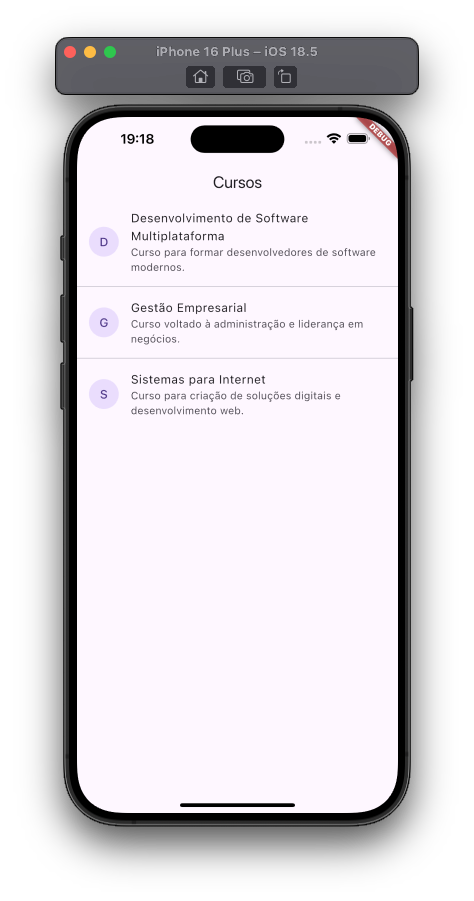

# TCShelf

Neste projeto iremo criar um aplicativo que irá mostrar os TCCs de voces como uma biblioteca digital, alem de divulgar cursos oferecidos na Etec Prefeito Alberto Feres.

## Dependências

Neste projeto iremos utilizar as seguintes dependências:

- Supabase - Banco de dados
- Riverpod - Gerenciamento de estado
- Riverpod_annotation - Anotações para Riverpod
- Riverpod_generator - Geração de código para Riverpod
- Freezed - Geração de código para classes imutáveis
- Freezed_annotation - Anotações para Freezed
- Build_runner - Geração de código
- DotEnv - Variáveis de ambiente

### Instalando dependências

Na raiz do projeto execute o seguintes comandos:

```bash
flutter pub add flutter_dotenv flutter_riverpod freezed_annotation go_router json_annotation riverpod_annotation supabase_flutter

flutter pub add --dev build_runner freezed json_serializable riverpod_generator
```

## Criando a classe App

1. Crie o arquivo src/app.dart;
2. Copie o código abaixo para o arquivo src/app.dart;

```dart
import 'package:flutter/material.dart';
import 'package:flutter_riverpod/flutter_riverpod.dart';
import 'package:tcc_flutter_app/src/core/providers/app_providers.dart';

class App extends ConsumerWidget {
  const App({super.key});

  @override
  Widget build(BuildContext context, WidgetRef ref) {
    return MaterialApp.router (
      routerConfig: null,
    );
  }
}
```

## Ajustar o main.dart

1. Abra o arquivo main.dart;
2. Copie o código abaixo para o arquivo main.dart;

```dart
import 'package:flutter/material.dart';
import 'package:tcc_flutter_app/src/app.dart';

void main() {
  runApp(const App());
}
```

## Configurando o Supabase

1. No arquivo main.dart, ajuste o código para inicializar o Supabase;

```dart
import 'package:flutter/material.dart';
import 'package:tcc_flutter_app/src/app.dart';
import 'package:supabase_flutter/supabase_flutter.dart';

void main() async {
  WidgetsFlutterBinding.ensureInitialized();
  await dotenv.load(fileName: '.env'); 
  await Supabase.initialize(
    url: dotenv.env['SUPABASE_URL']!, 
    anonKey: dotenv.env['SUPABASE_ANON_KEY']!,
  );
  runApp(ProviderScope(child: const App()));
}
```

## Configurando o dotenv

O dotenv é um package que permite que você crie variáveis de ambiente para sua aplicação, protegendo-as no código-fonte.

1. Crie o arquivo .env na raiz do projeto;
2. Copie o código abaixo para o arquivo .env;

```dart
SUPABASE_URL=sua_url_supabase
SUPABASE_ANON_KEY=sua_chave_anonima_supabase
```

> Lembre-se de substituir os valores de SUPABASE_URL e SUPABASE_ANON_KEY pelo valores do seu projeto no Supabase. Já fizemos estas configurações em sala de aula, utilize sua credenciais do Supabase.

> Lembre-se de adicionar o arquivo .env na pasta .gitignore, para que ele não seja enviado para o repositório remoto.


## Utilizando o MVVM como estrutura de arquitetura

Nós iremos utilizar o MVVM como estrutura de arquitetura para o nosso aplicativo. O MVVM é um padrão de arquitetura que permite que você separe a lógica de negócios da interface do usuário.

Os providers irão gerenciar o estado da aplicação, ou seja, irão controlar os dados que serão exibidos na interface do usuário.

Iremos utilizar vários providers me nosso aplicativo, eles serão a base para a criação de um estado global da aplicação, assim como o pattern MVVM.

### Criando nossos primeiros providers

1. Crie o arquivo src/core/providers/app_providers.dart;
2. Copie o código abaixo para o arquivo src/core/providers/app_providers.dart;

```dart
import 'package:flutter_riverpod/flutter_riverpod.dart';
import 'package:supabase_flutter/supabase_flutter.dart';

final darkModeProvider = StateProvider<bool>((ref) => false);
final supabaseProvider = Provider<SupabaseClient>((ref) => Supabase.instance.client);
```

> O `Provider` é um provider que permite que você compartilhe o estado de uma variável globalmente na aplicação, o `StateProvider` além de compartilhar o estado de uma variável globalmente na aplicação, ele permite que você altere o estado de uma variável globalmente na aplicação.

Iremos reutilizar o `SupabaseClient` em todos os providers que precisarem de acesso ao banco de dados.

### Criando o Model

1. Crie o arquivo src/features/cursos/model/curso_model.dart;
2. Copie o código abaixo para o arquivo src/features/cursos/model/curso_model.dart;

```dart
import 'package:freezed_annotation/freezed_annotation.dart';

part 'curso_model.g.dart';
part 'curso_model.freezed.dart';

@freezed
class CursoModel with _$CursoModel {
  const factory CursoModel({
    required String id,
    required String nome,
    required String descricao,
    required String professor,
    required String imagem,
  }) = _CursoModel;

  factory CursoModel.fromJson(Map<String, dynamic> json) =>
      _$CursoModelFromJson(json);
}
```

> Execute o comando abaixo para gerar o código do model:

```bash
flutter pub run build_runner build -d
```

### Criando o Repository de Cursos

Iremo utulizar o pattern `Repository` para criar um repositório de cursos.

1. Crie o arquivo src/features/cursos/model/repository/curso_repository.dart;
2. Copie o código abaixo para o arquivo src/features/cursos/model/repository/curso_repository.dart;

```dart
import 'package:tcc_flutter_app/src/features/cursos/model/curso_model.dart';

abstract class CursoRepository {
  Future<List<CursoModel>> getCursos();
}
```

### Criando o RepositoryImpl

1. Crie o arquivo src/features/cursos/model/repository/curso_repository_impl.dart;
2. Copie o código abaixo para o arquivo src/features/cursos/model/repository/curso_repository_impl.dart;

```dart
import 'package:riverpod_annotation/riverpod_annotation.dart';
import 'package:tcc_flutter_app/src/core/providers/app_providers.dart';
import 'package:tcc_flutter_app/src/features/cursos/model/curso_model.dart';
import 'package:tcc_flutter_app/src/features/cursos/model/repository/curso_repository.dart';

part 'curso_repository_impl.g.dart';

@riverpod
class CursoRepositoryImpl extends _$CursoRepositoryImpl implements CursoRepository {
  @override
  Future<List<CursoModel>> getCursos() async {
    final cursos = await ref.watch(supabaseProvider).from('cursos').select();
    return [for(final curso in cursos) CursoModel.fromJson(curso)];
  }
}
```

### Criando o provider para o repositorio de cursos

1. Altere o arquivo curso_repository_impl.dart para:

```dart
import 'package:flutter_riverpod/flutter_riverpod.dart';
import 'package:riverpod_annotation/riverpod_annotation.dart';
import 'package:supabase_flutter/supabase_flutter.dart';
import 'package:tcc_flutter_app/src/core/providers/app_providers.dart';
import 'package:tcc_flutter_app/src/features/cursos/model/curso_model.dart';
import 'package:tcc_flutter_app/src/features/cursos/model/repository/curso_repository.dart';

part 'curso_repository_impl.g.dart';

@riverpod
class CursoRepositoryImpl extends _$CursoRepositoryImpl implements CursoRepository {
  @override
  Future<List<CursoModel>> getCursos() async {
    final cursos = await ref.watch(supabaseProvider).from('cursos').select();
    return [for(final curso in cursos) CursoModel.fromJson(curso)];
  }
}

// Provider para o repositorio de cursos
@riverpod
cursoRepositoryImpl (Ref ref) {
  return CursoRepositoryImpl(supabase: ref.watch(supabaseProvider));
}
```

> Acima criamos o provider para o repositorio de cursos, ele será reutilizado como injecao de dependencia no projeto.

### Criando o View Model

1. Crie o arquivo src/features/cursos/viewmodel/cursos_viewmodel.dart;
2. Copie o código abaixo para o arquivo src/features/cursos/viewmodel/cursos_viewmodel.dart;

```dart
import 'package:riverpod_annotation/riverpod_annotation.dart';
import 'package:tcc_flutter_app/src/features/cursos/model/curso_model.dart';
import 'package:tcc_flutter_app/src/features/cursos/model/repository/curso_repository_impl.dart';

part 'cursos_viewmodel.g.dart';

@Riverpod(keepAlive: true)
class CursosViewModel extends _$CursosViewModel {
  @override
  FutureOr<List<CursoModel>> build() async {
    return ref.watch(cursoRepositoryImplProvider).getCursos();
  }
}
```

3. Execute o comando abaixo para gerar o código do view model:

```bash
flutter pub run build_runner build -d
```

> Agora o view model foi gerado e ele irá utilizar o repositorio de cursos para buscar os cursos para gerar o estado ao qual nossas Views irão se inscrever para receber os cursos.

### Criando a View CursosView

1. Crie o arquivo src/features/cursos/view/cursos_view.dart;
2. Copie o código abaixo para o arquivo src/features/cursos/view/cursos_view.dart;

```dart
import 'package:flutter/material.dart';
import 'package:flutter_riverpod/flutter_riverpod.dart';
import 'package:tcc_flutter_app/src/features/cursos/view/widgets/lista_cursos_widget.dart';
import 'package:tcc_flutter_app/src/features/cursos/viewmodel/cursos_viewmodel.dart';

class CursosView extends ConsumerWidget {
  const CursosView({super.key});

  @override
  Widget build(BuildContext context, WidgetRef ref) {
    final cursos = ref.watch(cursosViewModelProvider);
    return Scaffold(
      appBar: AppBar(title: const Text('Cursos')),
      body: cursos.when(
        data: (cursos) {
          return ListaCursosWidget(cursos: cursos);
        },
        error: (error, stackTrace) =>
            const Center(child: Text('Erro ao carregar cursos')),
        loading: () => const Center(child: CircularProgressIndicator()),
      ),
    );
  }
}
```
> Utilizamos o `ConsumerWidget` para que possamos utilizar o `WidgetRef` para acessar o `Provider` que irá nos fornecer os cursos. Também utilizamos o when para que possamos mostrar uma mensagem de loading, error ou data, este é um recurso do `riverpod` que nos ajuda a gerenciar o estado de forma mais simples.


3. Crie o arquivo src/features/cursos/view/widgets/lista_cursos_widget.dart;
4. Copie o código abaixo para o arquivo src/features/cursos/view/widgets/lista_cursos_widget.dart;

```dart
import 'package:flutter/material.dart';
import 'package:tcc_flutter_app/src/features/cursos/model/curso_model.dart';

class ListaCursosWidget extends StatelessWidget {
  const ListaCursosWidget({super.key, required this.cursos});

  final List<CursoModel> cursos;

  @override
  Widget build(BuildContext context) {
    return ListView.separated(
      itemCount: cursos.length,
      itemBuilder: (context, index) {
        final curso = cursos[index];
        return ListTile(
          leading: CircleAvatar(child: Text(curso.nome!.substring(0, 1))),
          title: Text(curso.nome!),
          subtitle: Text(curso.descricao!),
        );
      },
      separatorBuilder: (BuildContext context, int index) => const Divider(),
    );
  }
}

```
5. Crie o arquivo src/features/cursos/view/detalhe_curso_view.dart;
6. Copie o código abaixo para o arquivo src/features/cursos/view/detalhe_curso_view.dart;

```dart
import 'package:flutter/material.dart';
import 'package:tcc_flutter_app/src/features/cursos/model/curso_model.dart';

class DetalheCursoView extends StatelessWidget {
  const DetalheCursoView({super.key, required this.curso});

  final CursoModel curso;

  @override
  Widget build(BuildContext context) {
    return Scaffold(
      appBar: AppBar(title: Text(curso.nome!)),
      body: Center(
        child: Text(curso.descricao!),
      ),
    );
  }
}
```

## Utilizando o GoRouter para a navegação no aplicativo

Nós iremos utilizar o package `go_router` para a navegação no aplicativo. O GoRouter é um package que permite que você crie rotas para sua aplicação de forma simples e eficiente. 

> Agora que as views foram criadas, vamos criar as rotas para elas.


### Criando as rotas

1. Crie o arquivo src/core/routes/router.dart;
2. Copie o código abaixo para o arquivo src/core/routes/router.dart;

> Este código irá definir as rotas do aplicativo, no momento apenas as rotas de cursos e detalhes de cursos.

```dart
import 'package:go_router/go_router.dart';
import 'package:tcc_flutter_app/src/features/cursos/model/curso_model.dart';
import 'package:tcc_flutter_app/src/features/cursos/view/cursos_view.dart';
final router = GoRouter(
  initialLocation: '/cursos',
  routes: [
  GoRoute(
    path: '/cursos',
    builder: (context, state) => const CursosView(),
    routes: [
      GoRoute(
        path: '/curso',
        builder: (context, state) {
          final curso = state.extra as CursoModel;
          return DetalheCursoView(curso: curso);
        },
      )
    ]
  ),
]);
```

### Inicializando o GoRouter

1. Ajuste o arquivo app.dart para inicializar o GoRouter;
2. Inclua o objeto router no MaterialApp.router, no arquivo src/app.dart;

```dart
import 'package:flutter/material.dart';
import 'package:flutter_riverpod/flutter_riverpod.dart';
import 'package:tcc_flutter_app/src/core/providers/app_providers.dart';
import 'package:tcc_flutter_app/src/core/routes/router.dart';

class App extends ConsumerWidget {
  const App({super.key});

  @override
  Widget build(BuildContext context, WidgetRef ref) {
    return MaterialApp.router (
      routerConfig: router,
    );
  }
}
```

## Navegando com GoRouter

Precisamos ajustar o arquivo cursos_view.dart para que possamos navegar para a tela de detalhes do curso.

1. Ajuste o arquivo cursos_view.dart para que possamos navegar para a tela de detalhes do curso;
2. No arquivo ListaCursosWidget, ajuste o onTap para que possamos navegar para a tela de detalhes do curso;


```dart
import 'package:go_router/go_router.dart';
import 'package:tcc_flutter_app/src/features/cursos/model/curso_model.dart';
import 'package:tcc_flutter_app/src/features/cursos/view/cursos_view.dart';
import 'package:tcc_flutter_app/src/features/cursos/view/detalhe_curso_view.dart';

final router = GoRouter(
  initialLocation: '/cursos',
  routes: [
    GoRoute(
      path: '/cursos',
      builder: (context, state) => const CursosView(),
      routes: [
        GoRoute(
          path: '/curso',
          builder: (context, state) {
            final curso = state.extra as CursoModel;
            return DetalheCursoView(curso: curso);
          },
        ),
      ],
    ),
  ],
);

```
> Como temos apenas uma página no momento, esta será a rota inicial do aplicativo.



## Navegando com NavigationShell

Iremos utilizar a BottomNavigationBar para navegar entre as telas do aplicativo.

1. Crie o arquivo src/core/ui/widgets/navigation_shell_route.dart;
2. Copie o código abaixo para o arquivo src/core/ui/widgets/navigation_shell_route.dart;

```dart
import 'package:flutter/material.dart';
import 'package:go_router/go_router.dart';

class ScaffoldWithNavigationShell extends StatelessWidget {
  const ScaffoldWithNavigationShell({super.key, required this.shell});

  // Iremos para previnir issues de navegaçao e podermos criar sub-rotas nas configurações do GoRouter
  final StatefulNavigationShell shell;

  @override
  Widget build(BuildContext context) {
    return Scaffold(
      body: shell,
      bottomNavigationBar: NavigationBar(
        selectedIndex: shell.currentIndex,
        onDestinationSelected: (index) =>
            shell.goBranch(index, initialLocation: index == shell.currentIndex),
        destinations: [
          NavigationDestination(
            icon: Icon(Icons.home_outlined),
            selectedIcon: Icon(Icons.home),
            label: 'Home',
          ),
          NavigationDestination(
            icon: Icon(Icons.assignment_outlined),
            selectedIcon: Icon(Icons.assignment),
            label: 'Business',
          ),
          NavigationDestination(
            icon: Icon(Icons.school_outlined),
            selectedIcon: Icon(Icons.school),
            label: 'School',
          ),
          NavigationDestination(
            icon: Icon(Icons.event_note_outlined),
            selectedIcon: Icon(Icons.event_note),
            label: 'Event',
          ),
          NavigationDestination(
            icon: Icon(Icons.checklist_outlined),
            selectedIcon: Icon(Icons.checklist),
            label: 'Vestibulinho',
          ),
        ],
      ),
    );
  }
}

```

> Agora iremos ajustar a navegação inicial, incluir a página de cursos e realizar os testes iniciais de navegação.

3. Ajuste o arquivo router.dart para que possamos configurar as rotas inicias, assim como suas sub-rotas;
4. Inclua o código abaixo no arquivo router.dart;

```dart
import 'package:flutter/material.dart';
import 'package:go_router/go_router.dart';
import 'package:tcc_flutter_app/src/core/ui/widgets/navigation_shell_route.dart';
import 'package:tcc_flutter_app/src/features/cursos/model/curso_model.dart';
import 'package:tcc_flutter_app/src/features/cursos/view/cursos_view.dart';
import 'package:tcc_flutter_app/src/features/cursos/view/detalhe_curso_view.dart';

final router = GoRouter(
  initialLocation: '/cursos',
  routes: [
    StatefulShellRoute.indexedStack(
      builder: (context, state, navigationShell) =>
          ScaffoldWithNavigationShell(shell: navigationShell),
      branches: [
        StatefulShellBranch(
          routes: [
            GoRoute(
              path: '/home',
              builder: (context, state) =>
                  Container(color: Colors.red.shade100),
            ),
          ],
        ),
        StatefulShellBranch(
          routes: [
            GoRoute(
              path: '/projetos',
              builder: (context, state) =>
                  Container(color: Colors.green.shade100),
            ),
          ],
        ),
        StatefulShellBranch(
          routes: [
            GoRoute(
              path: '/cursos',
              builder: (context, state) => const CursosView(),
              routes: [
                GoRoute(
                  path: '/curso',
                  builder: (context, state) {
                    final curso = state.extra as CursoModel;
                    return DetalheCursoView(curso: curso);
                  },
                ),
              ],
            ),
          ],
        ),
        StatefulShellBranch(
          routes: [
            GoRoute(
              path: '/eventos',
              builder: (context, state) =>
                  Container(color: Colors.blue.shade100),
            ),
          ],
        ),
        StatefulShellBranch(
          routes: [
            GoRoute(
              path: '/vestibulinho',
              builder: (context, state) =>
                  Container(color: Colors.yellow.shade100),
            ),
          ],
        ),
      ],
    ),
  ],
);

```

> Configuramos a navegação inicial do aplicativo, adicionando as rotas principais e suas sub-rotas. A funcionalidade de cursos já esta criada, então a deixamos configurada como rota inicial, assim como a navegação para as demais telas está ajustada; conforme implementamos novas features elas serão ajustadas.


